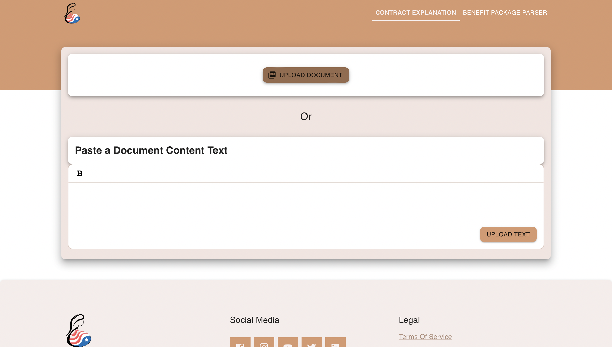
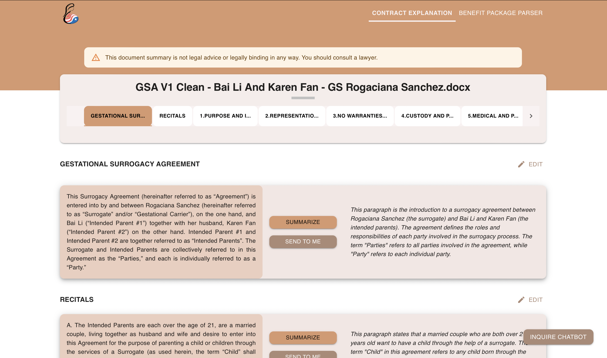
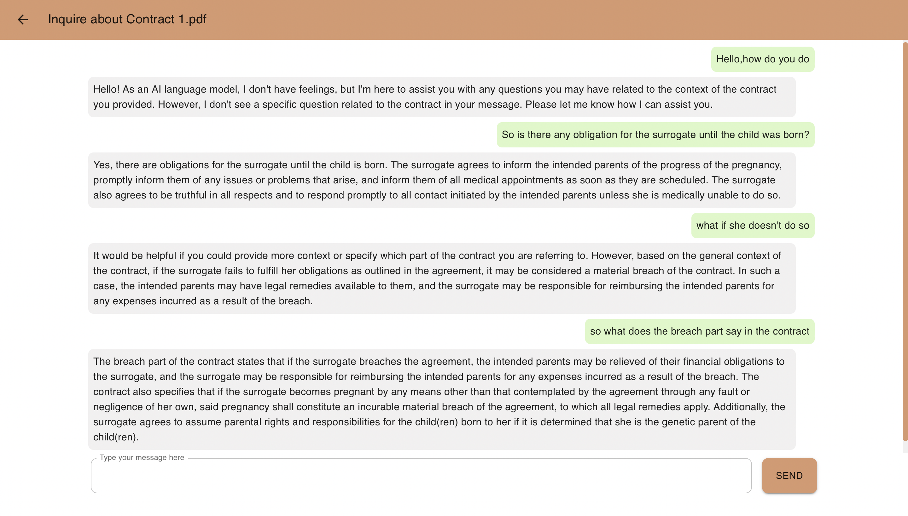
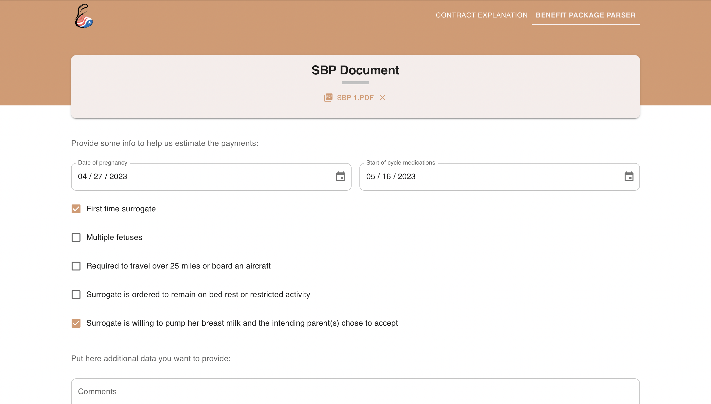
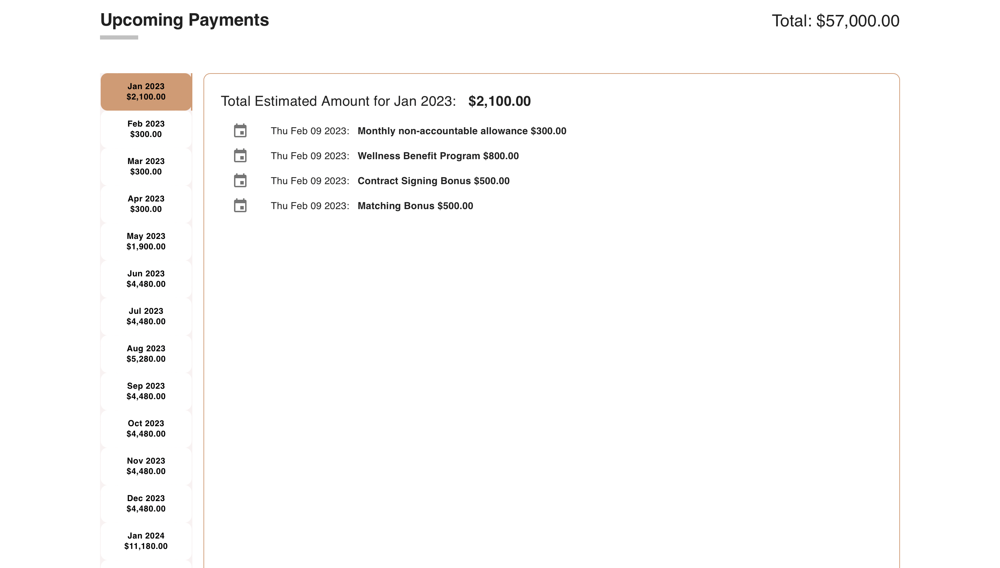

#Surrogacy Law Simplified
---
Welcome to [Surrogacy Law Simplified]!

Surrogacy Law Simplified is a cutting-edge website that simplifies the process of summarizing and explaining contract documents. Users can easily upload their contract document files and use its intuitive interface to summarize or explain each paragraph.

What sets Surrogacy Law Simplified apart is its advanced ChatGPT bot, which serves as a virtual assistant for users looking for additional information and context about their contracts. By leveraging the content of the uploaded contract document as its knowledge base, the ChatGPT bot can provide insightful answers to users' questions and offer valuable insights about the content of the contract.

Whether you are a legal professional or simply someone looking to better understand your contractual obligations, Surrogacy Law Simplified is the perfect tool to help you stay on top of your contracts and make more informed decisions. With its powerful features and user-friendly interface, Surrogacy Law Simplified is the ideal solution for anyone looking to streamline their contract management workflow and take their business to the next level.

## Functionalities
1. Go to deployed [Web App Site]
2. Upload Contract or other text-based documents in [Contract Parser]:
   
3. View by sections and Summarize by paragraphs:
   
4. Inquire with Chat GPT
   
5. Upload Surrogate Benefit Package in [Benefit Package],and fill in relevant info:
   
6. Got payment info table:
   

## Features
This project mostly applied and used 
- OpenAI ChatGPT for 
  - documents/payments files parsing
  - text chunk summarization
  - document content chatting and inquiry
- Supabase for
  - storing and fetching text chunks by [Vector Embeddings]
- integrated functionalities for pdf/docx files storing/parsing
- custom prompt chain for various parsing tasks

## RoadMap
- test to make current functionality more stable and decrease the chance of errors during OpenAI usage
- try to increase the efficiency (time for GPT interation and token spent) on OpenAI usage
- explore more possible ways to get better description and analyse on documents file, by OpenAI means or other AI or non-AI means.

[Surrogacy Law Simplified]: https://surrogacy.carrd.co/
[Web App Site]: https://gs-law-simplified.vercel.app
[Contract Parser]: https://gs-law-simplified.vercel.app
[Benefit Package]: https://gs-law-simplified.vercel.app/sbp
[Vector Embeddings]: https://platform.openai.com/docs/guides/embeddings/what-are-embeddings